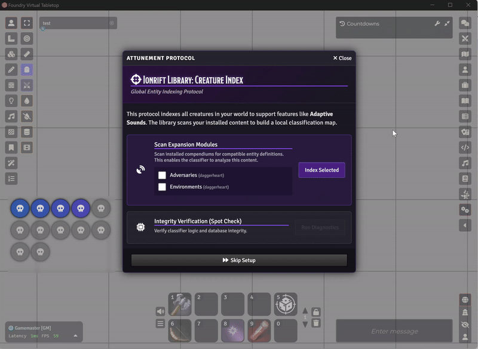

# Ionrift Library


💜 **[Support on Patreon](https://www.patreon.com/ionrift)**

**The Core Library for Ionrift modules.**

Shared utilities for the Ionrift ecosystem supporting **DnD5e** and **[Daggerheart](https://foundryvtt.com/packages/daggerheart)**. Centralizes logic between modules to prevent code drift and fragmentation. **Ionrift Resonance** uses the library to classify a "Skeleton", ensuring consistent behavior across the suite.


## Setup



First-time setup walks you through:
1. Registering the library with your world
2. Configuring integration status checks
3. Verifying creature classifier data

## Features

### Creature Classifier


Standardizes actor data into concept IDs (`undead`, `construct`) and prompts.

**Usage:**
```javascript
// Check if library is active
if (game.ionrift?.library?.classifyCreature) {
    const result = game.ionrift.library.classifyCreature(actor.name);
    
    if (result.id !== "unknown") {
        console.log(result.id);          // e.g. "skeleton"
        console.log(result.sound);       // e.g. "MONSTER_SKELETON"
        console.log(result.tags);        // Set of tags: {"undead", "skeleton", "bone"}
        console.log(result.confidence);  // 0.0 to 1.0
    }
}
```

### System Check
On `ready`, the library runs a self-diagnostic unit test to ensure the classification logic is performing as expected. Check the Console (F12) for the `[PASS]` report.

## Integration
To use this in your module, add it to your `module.json` dependencies:

```json
"relationships": {
    "requires": [
        { "id": "ionrift-library", "type": "module" }
    ]
}
```

---

## License
MIT License. See [LICENSE](./LICENSE) for details.

---
*Part of the [Ionrift Module Suite](https://github.com/ionrift-gm).*
