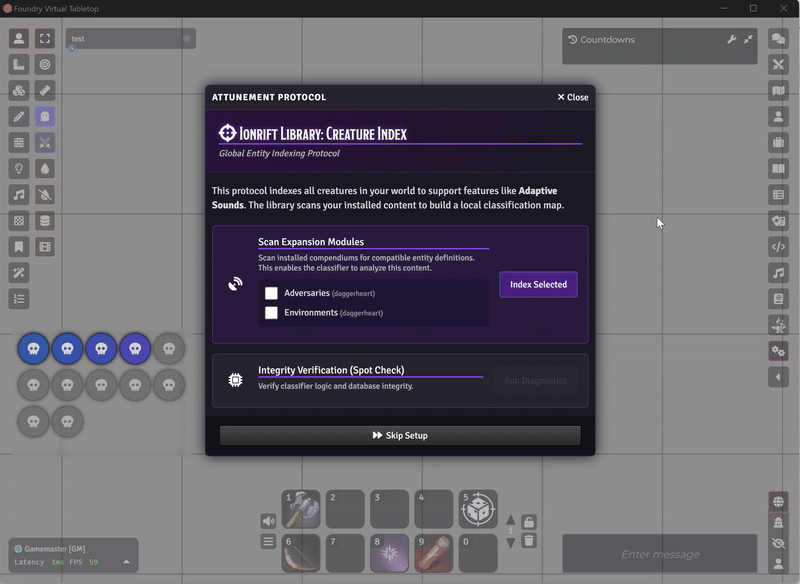

# Ionrift Library


**The Core Library for Ionrift modules.**

Shared utilities for the Ionrift ecosystem supporting **DnD5e** and **[Daggerheart](https://foundryvtt.com/packages/daggerheart)**. Centralizes logic between modules to prevent code drift and fragmentation. **Ionrift Resonance** uses the library to classify a "Skeleton", ensuring consistent behavior across the suite.

### Support Ionrift

[](https://patreon.com/ionrift)
[](https://discord.gg/vFGXf7Fncj)

> Documentation, setup guides, and troubleshooting: **[Ionrift Wiki](https://github.com/ionrift-gm/ionrift-library/wiki)**

## Setup



First-time setup walks you through:
1. Registering the library with your world
2. Configuring integration status checks
3. Verifying creature classifier data

For detailed installation steps, troubleshooting, and FAQ see the **[Setup: Core Library](https://github.com/ionrift-gm/ionrift-library/wiki/1-Setup-Core-Library)**.

## Features

### Creature Classifier


Standardizes actor data into concept IDs (`undead`, `construct`) and prompts.

**Usage:**
```javascript
// Check if library is active
if (game.ionrift?.library?.classifyCreature) {
    const result = game.ionrift.library.classifyCreature(actor.name);
    
    if (result.id !== "unknown") {
        console.log(result.id);          // e.g. "skeleton"
        console.log(result.sound);       // e.g. "MONSTER_SKELETON"
        console.log(result.tags);        // Set of tags: {"undead", "skeleton", "bone"}
        console.log(result.confidence);  // 0.0 to 1.0
    }
}
```

### System Check
On `ready`, the library runs a self-diagnostic unit test to ensure the classification logic is performing as expected. Check the Console (F12) for the `[PASS]` report.

## Integration
To use this in your module, add it to your `module.json` dependencies:

```json
"relationships": {
    "requires": [
        { "id": "ionrift-library", "type": "module" }
    ]
}
```

---

## Documentation

Full guides, screenshots, and troubleshooting on the **[Ionrift Wiki](https://github.com/ionrift-gm/ionrift-library/wiki)**:

- **[Setup: Core Library](https://github.com/ionrift-gm/ionrift-library/wiki/1-Setup-Core-Library)** - Installation and creature indexing
- **[Setup: Resonance](https://github.com/ionrift-gm/ionrift-library/wiki/2-Setup-Resonance)** - Sound configuration and presets
- **[Resonance Calibration](https://github.com/ionrift-gm/ionrift-library/wiki/3-Resonance-Calibration)** - Fine-tuning sound bindings
- **[Advanced Diagnostics](https://github.com/ionrift-gm/ionrift-library/wiki/4-Advanced-Diagnostics)** - Manifest inspection and troubleshooting
- **[Targeting Sounds Per Creature](https://github.com/ionrift-gm/ionrift-library/wiki/5-Targeting-Sounds-Per-Creature)** - Per-item and per-actor sound scoping

## Bug Reports

If something isn't working:

1. Check the **[wiki](https://github.com/ionrift-gm/ionrift-library/wiki)** for common fixes.
2. Post to the **[Ionrift Discord](https://discord.gg/vFGXf7Fncj)** with your Foundry version, module versions, and any console errors (F12).
3. Or open a **[GitHub Issue](https://github.com/ionrift-gm/ionrift-library/issues)**.

---

**Part of the [Ionrift Module Suite](https://github.com/ionrift-gm)**

[Wiki / Guides](https://github.com/ionrift-gm/ionrift-library/wiki) · [Discord](https://discord.gg/vFGXf7Fncj) · [Patreon](https://patreon.com/ionrift)

