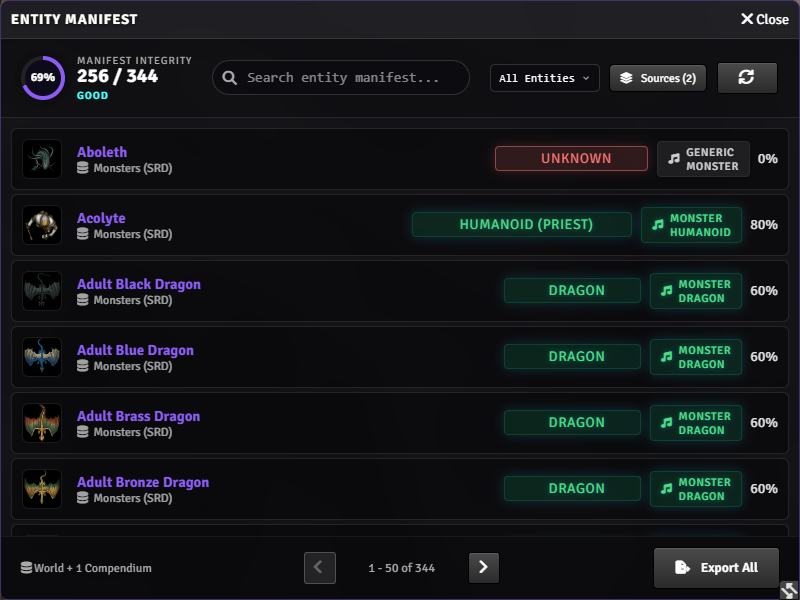
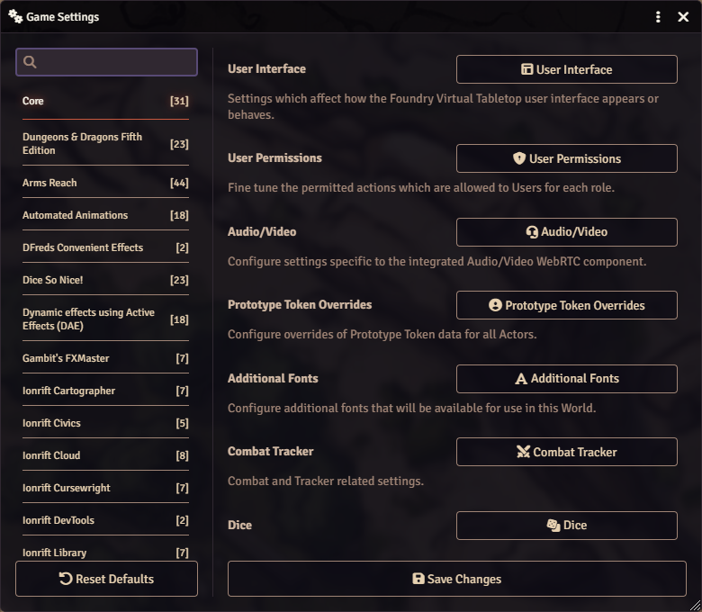

# Ionrift Library


**Core shared infrastructure, multi-system adapters, and creature taxonomy for the Ionrift module suite.**

### Support Ionrift

[](https://patreon.com/ionrift)
[](https://discord.gg/vFGXf7Fncj)

> Documentation, setup guides, and troubleshooting: **[Ionrift Wiki](https://github.com/ionrift-gm/ionrift-library/wiki)**

Ionrift Library provides common data contracts, multi-system adapters, tabletop roll requests, and creature taxonomy for all Ionrift modules.

---

## Core Capabilities

- **Multi-System Adapters.** Native normalization for DnD 5e, Pathfinder 2e, Starfinder 2e, Daggerheart, and Universal Tabletop systems. Keeps sheet data, rests, and roll calculations consistent across modules.
- **Tabletop Roll Requests.** Interactive prompt cards for ability checks, saving throws, and skill challenges. Includes live DC pulse cues, advantage selectors, and dice settle animations.
- **Creature Index & Taxonomy.** Standardizes actor data into concept identifiers (`undead`, `construct`, `beast`) and confidence ratings. Powers audio triggers in Resonance and recipe unlocks in Monstrous Feast.
- **Shared Cooking Engine.** Centralized ingredient classification, condition multipliers, and active effect buff resolution shared between Respite and Monstrous Feast.
- **Environmental & Species Registries.** Unified biome definitions (`TerrainRegistry`) and creature taxonomy tables (`SpeciesRegistry`) shared across the suite.
- **Party Roster Service.** Cross-module tracking for active adventuring party members, linked canvas tokens, and actor caching.
- **In-Game Bug Reporter.** Bundles console captures, active versions, and module states into structured support reports without exposing sensitive data.



---

## Setup & Configuration

1. Install **Ionrift Library** from the Foundry VTT package manager.
2. Enable the module in your world.
3. Access tools under **Game Settings > Module Settings > Ionrift Library**:
   - **Party Roster:** Designate active party characters.
   - **Entity Manifest:** Inspect creature classifications, confidence scores, and taxonomy tags.
   - **Token Manifest:** Review curated token art coverage and directory paths.
   - **Custom Terrains:** Manage custom terrain definitions for rest and loot generation.



---

## Developer Integration

Dependent modules declare Ionrift Library in `module.json`:

```json
"relationships": {
    "requires": [
        {
            "id": "ionrift-library",
            "type": "module",
            "compatibility": { "minimum": "3.0.0" }
        }
    ]
}
```

### Creature Classification API

```javascript
if (game.ionrift?.library?.classifyCreature) {
    const result = game.ionrift.library.classifyCreature(actor.name);
    if (result.id !== "unknown") {
        console.log(result.id);          // e.g. "skeleton"
        console.log(result.sound);       // e.g. "MONSTER_SKELETON"
        console.log(result.tags);        // e.g. Set {"undead", "skeleton", "bone"}
        console.log(result.confidence);  // 0.0 to 1.0
    }
}
```

---

## Requirements

- **Foundry VTT:** v12 through v14.
- **Supported Game Systems:** DnD 5e, Pathfinder 2e, Starfinder 2e, Daggerheart, or Universal Tabletop systems.

---

## Bug Reports

1. Check the **[Ionrift Wiki](https://github.com/ionrift-gm/ionrift-library/wiki)** for common setup guides.
2. Post to the **[Ionrift Discord](https://discord.gg/vFGXf7Fncj)** with your Foundry version, module versions, and console output.
3. Open a **[GitHub Issue](https://github.com/ionrift-gm/ionrift-library/issues)**.

---

## License

Released under the [MIT License](./LICENSE).

---

**Part of the [Ionrift Module Suite](https://github.com/ionrift-gm)**

[Wiki](https://github.com/ionrift-gm/ionrift-library/wiki) · [Discord](https://discord.gg/vFGXf7Fncj) · [Patreon](https://patreon.com/ionrift)
